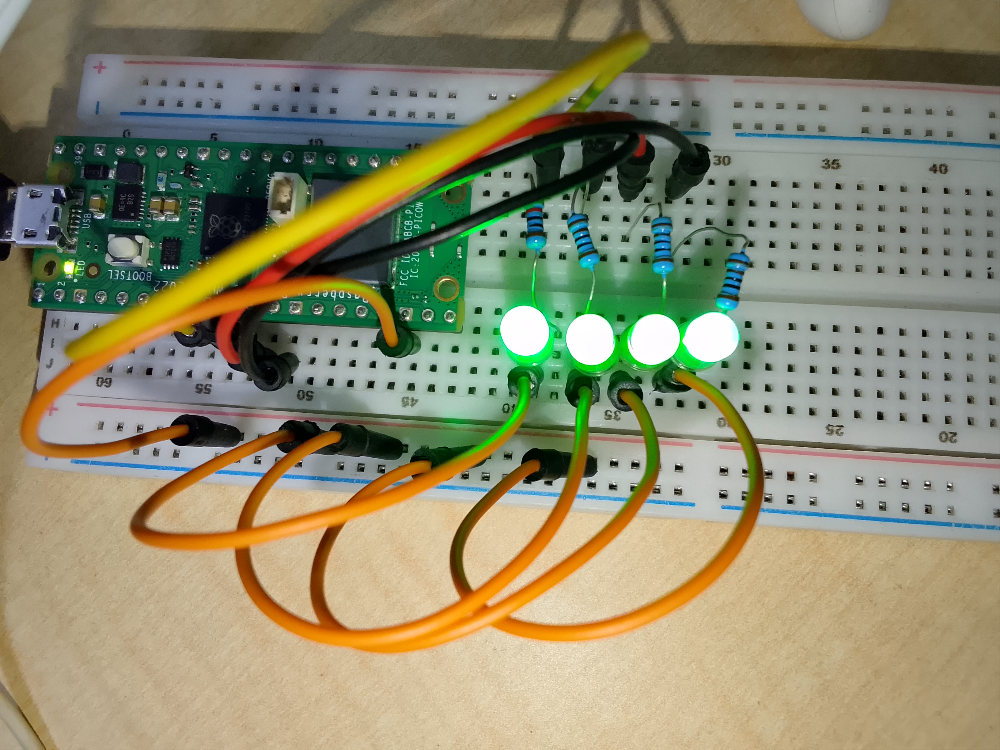

# Binary-LED-Counter-using-Raspberry-Pi-Pico-W
This project demonstrates a 4-bit binary counter using LEDs connected to the Raspberry Pi Pico W.

## Project Overview
Four LEDs are used to represent binary values from 0000 to 1111 (decimal 0 to 15).

The Raspberry Pi Pico W controls the LEDs through GPIO pins and updates the binary value every second.

## Components Used
- Raspberry Pi Pico W
- 4 LEDs
- 4 × 220Ω resistors
- Breadboard
- Jumper wires

## GPIO Connections
- LED 1 → GPIO 6
- LED 2 → GPIO 7
- LED 3 → GPIO 8
- LED 4 → GPIO 9

## Learning Outcome
- Understanding binary numbers
- Multiple GPIO output control
- Digital logic representation
- Sequential embedded programming

## Project Images

## Project Code
[Click Here for the project code](code/binary_led_counter_project.py)

## Project Demostration video
[Click here for the project demo video](https://youtu.be/ckKX2D1V1zg)
